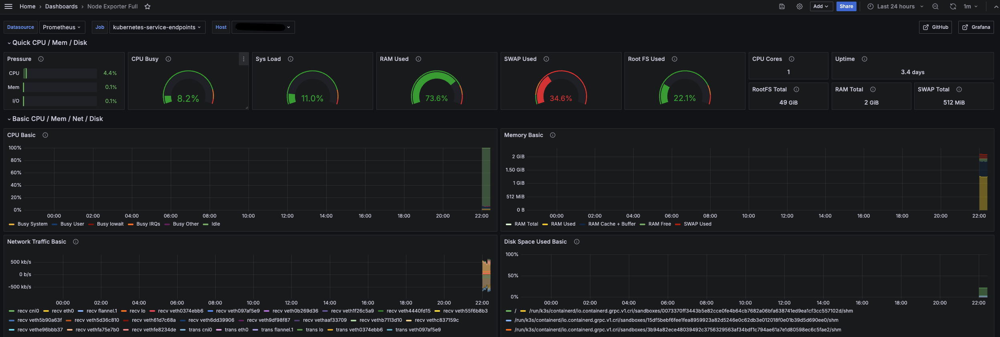
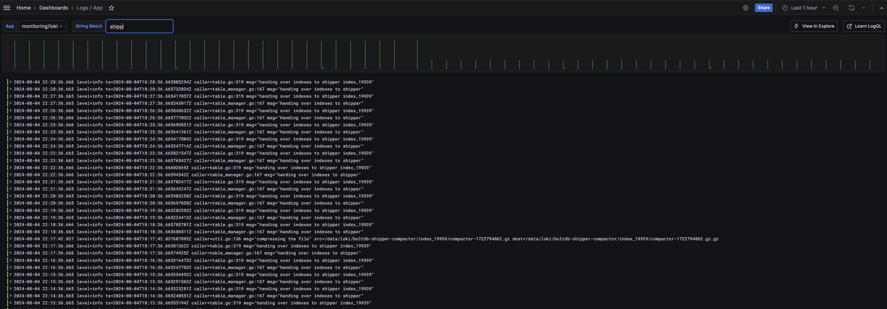

# k3s-on-linode


This project provides Infrastructure as Code (IaC) scripts to deploy a K3s Kubernetes cluster on Linode using Terraform and Ansible. It sets up a single-node K3s cluster with monitoring, a VPN, and other essential components for a production-ready Kubernetes environment.

## Features

- Automated deployment of a K3s cluster on Linode
- Integrated monitoring stack with Prometheus, Loki (with Promtail) and Grafana.
- WireGuard VPN for secure cluster access
- Cert-Manager for automatic SSL/TLS certificate management
- Traefik as the Ingress Controller
- Linode CSI Driver for dynamic volume provisioning

## Default dashboards included

View metrics of the VPS via NodeExporter:


Search for logs across all your pods thanks to Loki with Promtail:


## Prerequisites

- [Terraform](https://www.terraform.io/) (v1.9+)
- [Ansible](https://docs.ansible.com/ansible/latest/installation_guide/intro_installation.html) (v2.17.2+)
- [kubectl](https://kubernetes.io/docs/tasks/tools/)
- [Helm](https://helm.sh/docs/intro/install/)
- A Linode account and API token

## Getting Started

1. Clone this repository:
   ```
   git clone https://github.com/tcpessoa/k3s-on-linode.git
   cd k3s-on-linode
   ```

2. Create a python virtual environment and activate it. Run `pip install -r requirements.txt`

3. Run the setup script:
   ```
   ./setup.sh
   ```

4. Edit the configuration files:
   - `terraform/terraform.tfvars`: Add your Linode API token and SSH key path
   - `ansible/group_vars/all/vault.yml`: Set passwords and other sensitive information

5. Deploy the infrastructure:
   ```
   cd terraform
   terraform init
   terraform apply
   ```

6. Deploy K3s and additional components:
   ```
   cd ../ansible
   ansible-playbook playbooks/setup.yml
   ```

7. Retrieve the kubeconfig:
   ```
   ansible-playbook playbooks/retrieve_configs.yml
   ```

8. Access your cluster:
   - Use the kubeconfig file in `ansible/playbooks/configs/kubeconfig`
   - Set up WireGuard VPN using the web UI at `http://<LINODE_IP>:51821`. 

## Usage
Once your cluster is set up, you can deploy applications using kubectl or Helm. Here's an example of deploying a simple application:

```yaml
apiVersion: apps/v1
kind: Deployment
metadata:
  name: myapp
  namespace: default
spec:
  replicas: 1
  selector:
    matchLabels:
      app: myapp
  template:
    metadata:
      labels:
        app: myapp
    spec:
      containers:
      - name: myapp
        image: nginx:latest
        ports:
        - containerPort: 80
---
apiVersion: v1
kind: Service
metadata:
  name: myapp
  namespace: default
spec:
  selector:
    app: myapp
  ports:
    - port: 80
      targetPort: 80
---
apiVersion: networking.k8s.io/v1
kind: Ingress
metadata:
  annotations:
    cert-manager.io/cluster-issuer: letsencrypt-production
    spec.ingressClassName: traefik
  name: myapp
  namespace: default
spec:
  rules:
  - host: myapp.example.com
    http:
      paths:
      - backend:
          service:
            name: myapp
            port: 
              number: 80
        path: /
        pathType: Prefix
  tls:
  - hosts:
    - myapp.example.com
    secretName: myapp-example-com-tls
```

Save this as `myapp.yaml` and apply it with:

```
kubectl apply -f myapp.yaml
```

# Troubleshoot
- Run `ansible-playbook -vvvv ...` to increase verbosity of commands
- Run `ansible-playbook -vvv playbooks/debug_role.yml` with the desired role to debug a single step

# Improvements
- [ ] Automatically generate VPN conf file and get it (generating the wg conf is more complex then I imagined)

## Contributing

Contributions are welcome! Please feel free to submit a Pull Request.

## License

This project is licensed under the MIT License - see the [LICENSE](LICENSE) file for details.

## Acknowledgements

- [K3s](https://k3s.io/)
- [Linode](https://www.linode.com/)
- [Terraform](https://www.terraform.io/)
- [Ansible](https://www.ansible.com/)
